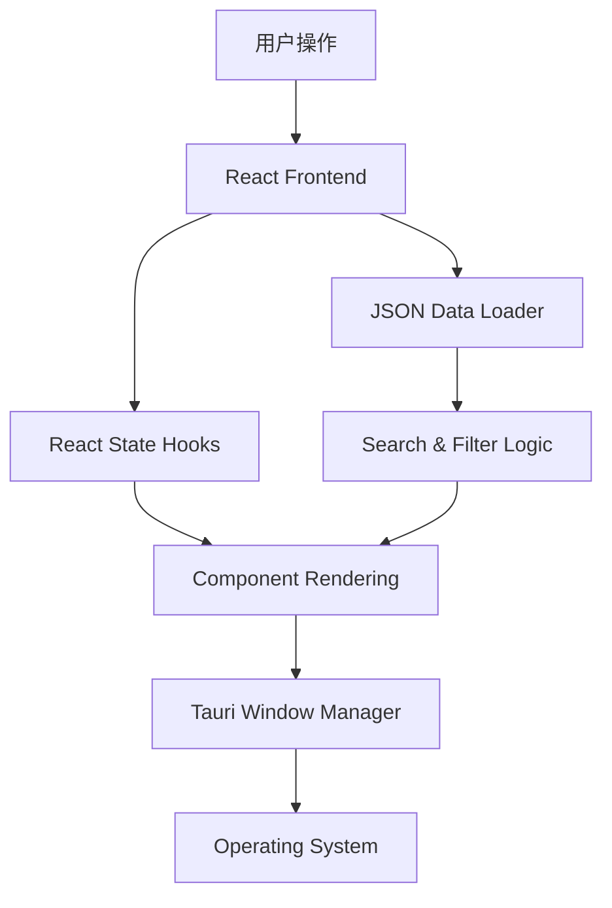
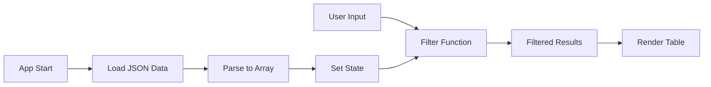

## Product Overview

一款基于 Tauri 2.0 + React + TypeScript + Tailwind CSS 的桌面应用程序，用于查询 H 型钢截面特性。应用复刻现有的玻璃拟态 UI 设计，支持通过国标数据文件进行精确搜索和筛选。

## Core Features

- **H 型钢查询**: 基于加载的 JSON 国标数据，查询 H 型钢的具体参数（如截面面积、惯性矩等）。
- **搜索与筛选**: 提供关键词搜索和规格筛选功能，快速定位目标型钢数据。
- **玻璃拟态 UI**: 实现半透明背景、模糊效果、细腻阴影的视觉风格，复刻原型设计。
- **Tauri 桌面特性**: 配置透明窗口、无边框自定义标题栏，支持窗口拖拽与系统交互。
- **响应式布局**: 基于 Tailwind CSS 确保界面在不同分辨率下保持美观与可用性。

## Tech Stack

- **Core Framework**: Tauri 2.0 (Rust)
- **Frontend Framework**: React 18 + TypeScript
- **Styling**: Tailwind CSS
- **Build Tool**: Vite
- **State Management**: React Hooks (useState, useEffect)
- **Data Handling**: 原生 JSON 解析

## Architecture Design

### System Architecture

采用前后端分离架构，Tauri 作为后端壳负责窗口管理与系统调用，React 作为前端处理 UI 逻辑与数据展示。



### Module Division

- **UI Components Module**: 包含搜索栏、数据表格、详情卡片等 React 组件。
- **Data Logic Module**: 负责加载、解析和筛选 JSON 国标数据。
- **Window Config Module**: Tauri 配置文件，处理透明窗口和自定义标题栏设置。
- **Style Module**: Tailwind 配置与玻璃拟态样式定义。

### Data Flow



## Implementation Details

### Core Directory Structure

```
tauri-hbeam-app/
├── src-tauri/
│   ├── src/
│   │   └── main.rs           # Tauri 入口与窗口配置
│   ├── Cargo.toml
│   └── tauri.conf.json       # 窗口透明与标题栏配置
├── src/
│   ├── components/           # React 组件
│   │   ├── SearchBar.tsx
│   │   ├── DataTable.tsx
│   │   └── GlassCard.tsx
│   ├── data/                 # JSON 国标数据文件
│   ├── hooks/                # 自定义 Hooks
│   ├── utils/                # 工具函数
│   ├── App.tsx
│   └── main.tsx
├── public/
├── package.json
└── tailwind.config.js
```

### Key Code Structures

- **Window Configuration**: 修改 `tauri.conf.json` 设置 `decorations: false` 和 `transparent: true`。
- **Data Loading**: 使用 `import` 或 `fetch` 加载本地 JSON 文件并解析为 TypeScript 接口类型。
- **Glassmorphism CSS**: 利用 Tailwind 的 `backdrop-blur` 和 `bg-opacity` 工具类实现玻璃效果。

### Technical Implementation Plan

1. **项目初始化**: 克隆 Tauri 模板，安装 React 与 TypeScript 依赖。
2. **UI 迁移**: 分析 `code.html`，将 DOM 结构拆解为 React 组件，使用 Tailwind 复刻样式。
3. **功能实现**: 实现数据加载、搜索算法和筛选逻辑。
4. **窗口配置**: 配置 Tauri 窗口属性，实现无边框和拖拽区域。
5. **数据集成**: 将现有的 JSON 国标数据文件放入 `src/data` 并编写接口定义。

### Integration Points

- **Tauri Commands**: 如需 Rust 端处理文件读取，可定义 Tauri Commands (Commands)。
- **JSON Data**: 直接在 React 前端通过静态导入读取 JSON，无需后端 API。
- **Window Interaction**: 使用 `@tauri-apps/api/window` API 控制窗口最小化、关闭等操作。

## Design Style

采用现代玻璃拟态设计风格。界面以半透明卡片为载体，配合深色磨砂背景，营造科技感与精致感。布局上采用左右分栏或上下结构，左侧/顶部为搜索与筛选区，右侧/主体为数据展示区。

## Design Content Description

**主页面布局**:

1. **顶部导航/标题栏**: 自定义无边框标题栏，包含应用图标、标题以及最小化/关闭按钮。背景采用高模糊度的半透明深色。
2. **搜索控制区**: 包含搜索输入框和筛选下拉菜单。输入框具有聚焦发光效果，筛选按钮使用悬停微交互。
3. **数据表格区**: 展示 H 型钢参数的表格。表头固定，行数据支持斑马纹或悬停高亮，字体清晰易读。
4. **玻璃卡片**: 用于包裹主要内容区域，边缘带有微弱发光和内阴影，增强层次感。

**交互与反馈**:

- 按钮和输入框具备平滑的 Transition 过渡效果。
- 搜索无结果时显示友好的空状态提示。
- 窗口支持拖拽，拖拽区域限定在标题栏。

## Agent Extensions

### SubAgent

- **code-explorer** (from <subagent>)
- Purpose: 探索 `d:/code/jiemian` 目录结构，分析 `UI原型/code.html` 文件内容及其样式定义
- Expected outcome: 理解现有 HTML 结构和 CSS 样式，为 React 组件拆分和 Tailwind 样式复刻提供依据

### Skill

- **skill-creator** (from <skills>)
- Purpose: 辅助规划或创建必要的技能脚本（如数据转换脚本，虽然当前主要依赖前端逻辑）
- Expected outcome: 确保开发流程标准化，若有必要自动化任务可生成相应脚本